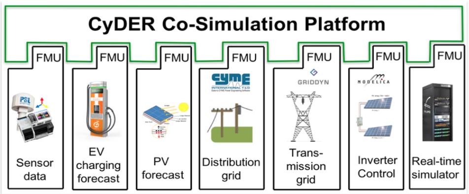

Overview
========

CyDER is a modular and scalable tool for power system planning and operation that is interoperable with utility software, data streams, and controls.

The complexity of distribution grids is drastically increasing as a result of integrating larger shares of distributed generation and storage devices, uncertainties in renewable power generation, and advanced electronics-based controllers. This necessitate new simulation tools to bridge the gap between distribution grids, buildings, electric vehicles, transmission lines.

The co-simulation of independent simulators on a common platform enable specialized software and third-party tools to be leveraged to study complex interdependencies between systems while preserving simplicity, transparency, flexibility, and scalability of the simulation environment.

The goal of the CyDER platform is to use a well-defined open industry standard (the FMI standard) to couple power system tools in different time domains and voltage levels, such as distribution and transmission system simulations, and real-time simulations, with tools that are not developed within the traditional scope of power systems (e.g. buildings, electric vehicles).

CyDER leverages the FMI standard to seamlessly integrate different software modules by using a standardized API with a well-defined semantics.
