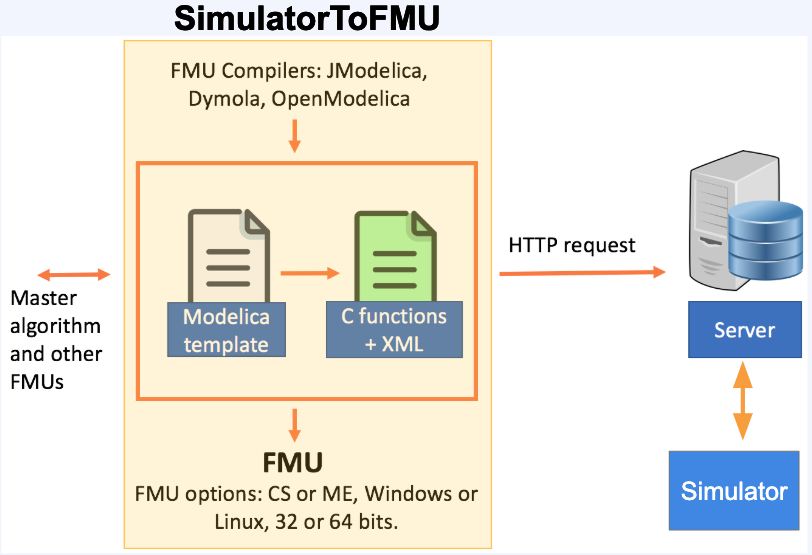
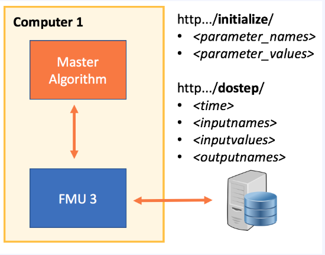

Notes for Developers
====================

The complete installation
-------------------------
  - Install JModelica 2.1 for SimulatorToFMU
  - Download SimulatorToFMU (and locate SimulatorToFMU.py)
  - Install CyDER from the "fmi-for-power_system" repository by running "pip install setup.py"

The specific of "server" FMUs
-----------------------------
The server FMU was created to communicate via HTTP between the compiled part of the FMU and the interpreted code (e.g. Python). This way FMUs could be run on different computers (e.g. a private company's server to maintain privacy), and also would not require the same Python interpreter for PyFMI and all the FMUs embedding Python.

The server that communicate with the FMU should implement at least two end points: initialize and dostep.

Building a "server" architecture FMU requires the following files:
  - a run_server.py file
  - a start_server.bat file
  - a model_description.xml

The next section provides a basic template for each of those files.

*run_server.py*

.. code-block:: python

  from __future__ import print_function
  from flask import Flask, request
  import os
  import socket
  import sys

  app = Flask(__name__)

  @app.route('/initialize/<parameter_names>&<parameter_values>')
  def initialize(parameter_names, parameter_values):
      # Create a variable to hold the CSV file
      return 'Server initialized'

  @app.route('/dostep/<time>&<inputnames>&<inputvalues>&<outputnames>')
  def step(time, inputnames, inputvalues, outputnames):
      inputs = _parse_url(time, inputnames, inputvalues, outputnames)
      outputs = []
      outputs.append(float(inputs['x']) + float(inputs['u']))
      print('Output values: ' + str(outputs), file=sys.stderr)
      return ','.join([str(output) for output in outputs])

  # Utility functions
  #################################################################
  def _parse_url(time, inputnames, inputvalues, outputnames):
      #Ensure that inputs has the right type
      data = {str(key):float(value)
              for key, value in
              zip(inputnames.split(','), inputvalues.split(','))}
      data['time'] = float(time)
      data['outputnames'] = outputnames.split(',')
      return data

  @app.route('/shutdown')
  def shutdown():
      func = request.environ.get('werkzeug.server.shutdown')
      if func is None:
          raise RuntimeError('Not running with the Werkzeug Server')
      func()
      return 'Server shutting down...'

  @app.route('/ping')
  def ping():
      return 'pinged'

  @app.errorhandler(Exception)
  def handle_error(e):
      #Handle error message back to the FMU
      return 'ERROR: ' + str(e)
  #################################################################

  if __name__ == '__main__':
      # Open the right port
      sock = socket.socket(socket.AF_INET, socket.SOCK_STREAM)
      address = 'localhost'
      sock.bind((address, 0))  # Get a free port at random with '0'
      port = sock.getsockname()[1]  # Retrieve the port and address
      sock.close()  # Close the socket and use the port with Flask

      # Write a file with port and address
      path_to_server = os.path.dirname(__file__)
      ping_server_code = """def main():
      import urllib2
      try:
          response = urllib2.urlopen("http://localhost:""" + str(port) + """/ping").read()
          response = response.decode('utf-8')
      except:
          response = 'bad request'
      if response in 'pinged':
          print('The Server is up')
          return 0
      else:
          print('The server is not up yet')
          return 1

  if __name__ == '__main__':
      import sys
      sys.exit(main())
      """

      # Write a file which allows checking if the server is up
      with open(os.path.join(path_to_server, "check_server.py"), "w") as py_ping:
          py_ping.write(ping_server_code)

      # Write te configuration file for connecting to the server
      with open(os.path.join(path_to_server, "server_config.txt"), "w") as config:
          config.write('address:' + address + ':port:' + str(port) + ':')

      # Start the server
      app.run(port=port, debug=True, use_reloader=False)

*start_server.bat*

.. code-block:: bash

  python %1/run_server.py

*model_description.xml*

.. code-block:: xml

  <?xml version="1.0" encoding="UTF-8"?>
  <SimulatorModelDescription
    xmlns:xsi="http://www.w3.org/2001/XMLSchema-instance"
    fmiVersion="2.0"
    modelName="bbq"
    description="Input data for a Simulator FMU"
    generationTool="SimulatorToFMU">
    <ModelVariables>
      <ScalarVariable
        name="x"
        description="input"
        causality="input"
        type="Real"
        unit="V">
      </ScalarVariable>
      <ScalarVariable
        name="u"
        description="input"
        causality="input"
        type="Real"
        unit="V">
      </ScalarVariable>
      <ScalarVariable
        name="y"
        description="output"
        causality="output"
        type="Real">
      </ScalarVariable>
    </ModelVariables>
  </SimulatorModelDescription>

*Command line to compile the FMU*

.. code-block:: bash

  python SimulatorToFMU.py -i model_description.xml ^
                           -s start_server.bat ^
                           -t jmodelica ^
                           -pt C:/JModelica.org-2.1 ^
                           -a me

Notes on SimulatorToFMU
-----------------------
SimulatorToFMU change the type of object sent to the Python exchange function based on the number of inputs. It provides a list for multiple inputs and a scalar variable for a single input. This is a common pit fall which needs to be fix in SimulatorToFMU.
