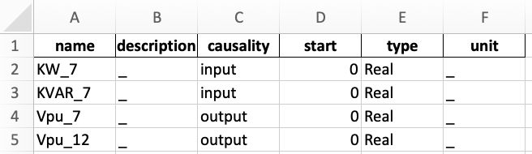

Compiling FMUs
==============
This section mostly focus on compiling FMUs with some embedded Python code. Note that it is also possible to obtain FMUs from Modelica code, Simulink blocks, and a variety of tools listed on the `FMI standard website <https://fmi-standard.org/tools/>`_.

Compiling Modelica code as FMU
------------------------------
This is possible with PyModelica which is based on the JModelica.org compiler.
You can find some Modelica templates under "example/004_getting_started/".

.. code-block:: python

  from pymodelica import compile_fmu
  compile_fmu('HELICS_CyDER.Generator',
              'HELICS_CyDER.mo',
              version='2.0',
              target='me')

Compiling Python code as FMU
----------------------------
`SimulatorToFMU <https://github.com/LBNL-ETA/SimulatorToFMU>`_ let you embed Python code within FMUs, it ultimately uses a compiler such as JModelica.org to create FMUs. You can find detailed documentation `here <https://github.com/LBNL-ETA/SimulatorToFMU/blob/master/simulatortofmu/userGuide.pdf>`_, but for convenience we detail the main steps to use SimulatorToFMU. In order to compile a new FMU SimulatorToFMU requires a Python file and an XML file describing the structure of the FMU (e.g. inputs/outputs).

The Python code should include the following function:

.. code-block:: python

  def exchange(configuration_filename, time, input_names,
               input_values, output_names, save_to_file=False,
               memory=None):
      result = [0] * len(output_names)
      return [result, memory]

Where:
  - time: Time of the simulation [Float],
  - input_names: List of input names [String],
  - input_values: List of input values [Float],
  - output_names: List of output names [String],
  - save_to_file: True or False can be used to trigger the FMU to save data [Boolean],
  - memory: None at first, can be returned to save states between function calls,
  - configuration_filename: Can be set to a string in the XML description to pass a configuration filename.

The format of the XML file is as follow:

.. code-block:: xml

  <?xml version='1.0' encoding='UTF-8'?>
  <SimulatorModelDescription xmlns:xsi="http://www.w3.org/2001/XMLSchema-instance"
                             fmiVersion="2.0"
                             modelName="simple"
                             description="simple"
                             generationTool="SimulatorToFMU">
    <ModelVariables>
      <ScalarVariable name="a" description="input 1" causality="input" type="Real" unit="m"/>
      <ScalarVariable name="b" description="input 2" causality="input" type="Real" unit="m"/>
      <ScalarVariable name="r" description="result" causality="output" type="Real" unit="m"/>
    </ModelVariables>
  </SimulatorModelDescription>

Note that you can also add a parameter in the XML format which will be passed to the Python function under "configuration_filename".

.. code-block:: xml

  <ScalarVariable
    name="_configurationFileName"
    description="parameter"
    causality="parameter"
    start="PATH TO SOME FILE"
    type="String">
  </ScalarVariable>

In order to launch SimulatorToFMU you can use the following command line.

.. code-block:: bash

  python PATH/SimulatorToFMU.py ^
    -i model_description.xml ^
    -s ./model_wrapper.py ^
    -x python ^
    -t jmodelica ^
    -pt C:/JModelica.org-2.1 ^
    -a me

Where:
  - -i: is the path to the XML description,
  - -s: is the path to the python function (such that the file is called MODELNAME_wrapper.py),
  - -x: is the structure of the FMU (python or server), more on that later,
  - -t: is the targeted compiler (Dymola, JModelica, OpenModelica),
  - -pt: is the path to the compiler,
  - -a: is the type of FMU (Model-Exchange "me" or Co-Simulation "cs")

Compiling Python code as FMU with CyDER
---------------------------------------

In order to ease the compilation of FMUs, the CyDER team developed a small utility function to abstract some of the details presented above. The compilation process takes an Excel or a CSV file describing inputs and outputs (instead of an XML file) as shown in the table below.

Finally, the compilation process can be triggered via the command line below.

.. code-block:: bash

  cyderc --path ./ --name modelname --io table.xlsx --fmu_struc python --fmu_type me

Where:
  - --path: is the path where the FMU will be created,
  - --name: is the name of the FMU,
  - --io: is the path of the Excel file defining the inputs and outputs,
  - --fmu_struc: is the architecture of the FMU (server or function),
  - --fmu_type: is the type of FMU (ME or CS).
